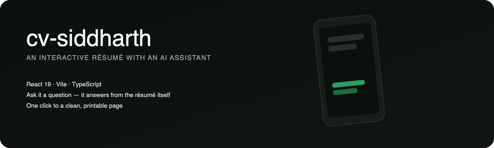

# cv-siddharth

<p align="center">
  
</p>

<p align="center">
  
  
  
  
  <a href="https://github.com/darkpandawarrior/cv-siddharth/actions/workflows/deploy-pages.yml"></a>
</p>

**Live: [darkpandawarrior.github.io/cv-siddharth](https://darkpandawarrior.github.io/cv-siddharth/)**

Interactive CV for **Siddharth Pandalai** — Senior Android Engineer. A portfolio
that demonstrates the work instead of listing it: case studies with real
production metrics, a pointer-tracked phone mockup (pure CSS 3D transforms, no
WebGL), a print-perfect
[résumé view](https://darkpandawarrior.github.io/cv-siddharth/#resume) (PDF via
the print dialog), and an AI assistant ("Sid") that answers questions about
his experience in first person.

Inspired by [santifer/cv-santiago](https://github.com/santifer/cv-santiago),
rebuilt and simplified: the entire CV fits in an LLM's context, so there is no
RAG pipeline — knowledge lives in a single system prompt
([api/_lib/system-prompt.ts](api/_lib/system-prompt.ts)).

## Stack

React 19 · TypeScript · Vite 7 · Tailwind v4 · Vercel Edge Functions ·
**provider-agnostic chat backend** — streams from Groq (Llama 3.3, free tier),
Google Gemini, or Anthropic Claude, whichever key is configured, normalized to
one SSE format so the widget never knows the difference.

## Quick start

```bash
npm install
cp .env.local.example .env.local   # add your ANTHROPIC_API_KEY to enable chat
npm run dev
```

Open http://localhost:5173. The site works without a key; the chat widget
shows a contact fallback until one of `GROQ_API_KEY` / `GEMINI_API_KEY` /
`ANTHROPIC_API_KEY` is set. In dev, a Vite middleware
([vite.config.ts](vite.config.ts)) serves `/api/chat` with the same handler
Vercel runs in production — no `vercel dev` needed.

## Deploy

### Option A — Vercel (site + chat in one place)

```bash
npx vercel
```

Set `ANTHROPIC_API_KEY` in the Vercel project's environment variables.
`api/chat.ts` runs on the Edge runtime and streams Anthropic SSE straight
through to the widget.

### Option B — GitHub Pages (static) + chat hosted elsewhere

GitHub Pages can't run serverless functions, so the site and the chat
backend split:

1. Push this repo to GitHub and enable **Settings → Pages → Source: GitHub
   Actions**. The included workflow
   ([.github/workflows/deploy-pages.yml](.github/workflows/deploy-pages.yml))
   builds and deploys on every push to `main`, handling the `/repo/` base
   path automatically.
2. For the chatbot, deploy the same repo to Vercel (free tier) for the
   `/api/chat` function only, then set a repo **variable** `CHAT_API_URL`
   (e.g. `https://cv-siddharth.vercel.app/api/chat`). On Vercel, set
   `ALLOWED_ORIGIN` to your Pages origin (e.g.
   `https://darkpandawarrior.github.io`) to scope CORS.
3. Without `CHAT_API_URL`, the site still deploys fine — the chat widget
   shows the email fallback.

## Structure

```
api/
├── chat.ts                  # Vercel Edge entry
└── _lib/
    ├── chat-handler.ts      # Web-standard handler (shared dev/prod)
    └── system-prompt.ts     # Sid persona + CV knowledge + guardrails
src/
├── App.tsx                  # All sections (hero, metrics, case studies…)
├── FloatingChat.tsx         # Chat widget — SSE streaming, quick prompts
├── data/profile.ts          # CV content (single source of truth)
└── index.css                # Tailwind v4 theme tokens
```

## Interactive surfaces

Beyond the scroll, the site is navigable as an environment:

- **`#terminal`** — a faux shell ([src/Terminal.tsx](src/Terminal.tsx)) that's
  a real interface: `help`, `projects`, `open mileway`, `cat resume.txt`,
  `skills`, `ask <question>` (hands off to the AI), `hire`, `theme <name>`,
  with ↑/↓ history and Tab completion. Everything reads `profile.ts`, so it
  can't drift. Reachable from ⌘K, the footer, and the mobile menu.
- **`#blueprint`** — the portfolio as an infinite tldraw canvas with live
  React/three.js custom shapes. Ships with a **Reset** button and a recovery
  boundary so a stale local snapshot or a lost WebGL context is never a dead
  blank screen.
- **Per-project share cards** — each build has a crawlable page at
  `/p/<slug>/` carrying its own Open Graph / Twitter meta and a branded
  1200×630 card, so a shared link previews the project, not the generic site.

## Generators

Content and assets are generated from `profile.ts` / the source repos so
nothing is hand-mirrored:

```bash
npm run gen:og        # branded per-project OG cards + /p/<slug>/ share pages
npm run refresh       # media sync + all generators (stats, galleries, og, prompt…)
```

`gen:og` rasterizes the cards with a headless Chromium at author time and
commits the PNGs — the Vercel build needs no browser.

## Updating content

Edit [src/data/profile.ts](src/data/profile.ts) for the page and
[api/_lib/system-prompt.ts](api/_lib/system-prompt.ts) for the chatbot —
keep the two in sync so Sid never contradicts the page.
