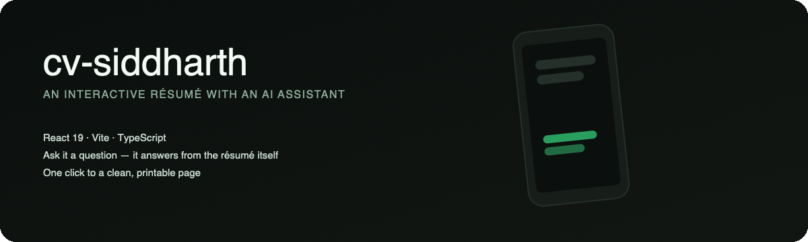

# cv-siddharth

<p align="center">
  
</p>

<p align="center">
  
  
  
  
  <a href="https://vercel.com/sid-pandalais-projects/cv-siddharth"></a>
</p>

**Live: [cv-siddharth.vercel.app](https://cv-siddharth.vercel.app/)**

Interactive CV for **Siddharth Pandalai** — Senior Android Engineer. A portfolio
that demonstrates the work instead of listing it: case studies with real
production metrics, a pointer-tracked phone mockup (pure CSS 3D transforms, no
WebGL), a print-perfect
[résumé view](https://cv-siddharth.vercel.app/resume) (PDF via
the print dialog), and an AI assistant ("Panda") that answers questions about
his experience in first person.

Inspired by [santifer/cv-santiago](https://github.com/santifer/cv-santiago),
rebuilt and simplified: the entire CV fits in an LLM's context, so there is no
RAG pipeline — knowledge lives in a single system prompt
([api/_lib/system-prompt.ts](api/_lib/system-prompt.ts)).

<p align="center">
  <b><a href="#stack">Stack</a></b>&nbsp;&nbsp;·&nbsp;&nbsp;<b><a href="#quick-start">Quick start</a></b>&nbsp;&nbsp;·&nbsp;&nbsp;<b><a href="#deploy">Deploy</a></b>&nbsp;&nbsp;·&nbsp;&nbsp;<b><a href="#structure">Structure</a></b>&nbsp;&nbsp;·&nbsp;&nbsp;<b><a href="#interactive-surfaces">Interactive surfaces</a></b>&nbsp;&nbsp;·&nbsp;&nbsp;<b><a href="#generators">Generators</a></b>
</p>

## Stack

React 19 · TypeScript 7 · Vite 8 · TanStack Start · Tailwind v4 · Vercel ·
**provider-agnostic chat backend** — streams from Groq (Llama 3.3, free tier),
Google Gemini, or Anthropic Claude, whichever key is configured, normalized to
one SSE format so the widget never knows the difference.

**TypeScript 7.0.2 compatibility note:** The repo runs TypeScript 7.0.2 for compilation (`npx tsc --version` confirms it). Because `typescript-eslint` doesn't support TS 7's compiler API yet (support lands in 7.1), `package.json` uses Microsoft's documented side-by-side pattern: `@typescript/native` (real TS 7.0.2) + `@typescript/typescript6` (TS 6.0-API shim for lint). If lint ever fails with "typescript-eslint does not support TS 7.0" after an `npm install`, check `npx tsc --version` first — if it's not 7.0.2, run `npm install` again to resolve the `tsc` binary race.

## Quick start

```bash
npm install
cp .env.local.example .env.local   # add your ANTHROPIC_API_KEY to enable chat
npm run dev
```

Open http://localhost:5173. The site works without a key; the chat widget
shows a contact fallback until one of `GROQ_API_KEY` / `GEMINI_API_KEY` /
`ANTHROPIC_API_KEY` is set. In dev, a Vite middleware
([vite.config.ts](vite.config.ts)) serves `/api/chat` with the same handler
Vercel runs in production — no `vercel dev` needed.

## Deploy

Single target: Vercel hosts the TanStack Start server and the chat function
together.

```bash
npx vercel
```

Set `ANTHROPIC_API_KEY` (or `GROQ_API_KEY` / `GEMINI_API_KEY`) in the Vercel
project's environment variables. `api/chat.ts` runs on the Edge runtime and
streams SSE straight through to the widget — no separate chat host.

That endpoint spends the owner's API key, so it defends itself
([api/\_lib/chat-handler.ts](api/_lib/chat-handler.ts)): an **origin allowlist**
(the live site, this deployment's own Vercel hostnames so previews work,
localhost, plus anything in `ALLOWED_ORIGIN` — a request with no `Origin` header
is refused), a **per-IP rate limit** (`CHAT_RATE_PER_MIN`, default 10;
`CHAT_RATE_PER_HOUR`, default 60 → `429` + `Retry-After`), and **payload caps**
(≤60 messages, ≤64 KB body, ≤2000 chars per user turn, history trimmed to
~24k chars before it reaches a provider). The rate limiter is per-isolate and
therefore best-effort — see the comment above it for what a durable version
would take. `vercel.json` pins the SSR function to `bom1` (Mumbai)
and sets long-lived immutable caching for the WASM lab bundles; TanStack
Start's own router handles all page routing, so there's no rewrite rule to
maintain.

## Structure

<details>
<summary><b>The map</b> — where the API, the chat handler, and the single source of truth live</summary>
<br/>

```
api/
├── chat.ts                  # Vercel Edge entry
└── _lib/
    ├── chat-handler.ts      # Web-standard handler (shared dev/prod)
    └── system-prompt.ts     # Panda persona + CV knowledge + guardrails
src/
├── App.tsx                  # All sections (hero, metrics, case studies…)
├── FloatingChat.tsx         # Chat widget — SSE streaming, quick prompts
├── data/profile.ts          # CV content (single source of truth)
└── index.css                # Tailwind v4 theme tokens
```

</details>

## Interactive surfaces

Beyond the scroll, the site is navigable as an environment:

- **`#terminal`** — a faux shell ([src/Terminal.tsx](src/Terminal.tsx)) that's
  a real interface: `help`, `projects`, `open mileway`, `cat resume.txt`,
  `skills`, `ask <question>` (hands off to the AI), `hire`, `theme <name>`,
  with ↑/↓ history and Tab completion. Everything reads `profile.ts`, so it
  can't drift. Reachable from ⌘K, the footer, and the mobile menu.
- **`#blueprint`** — the portfolio as an infinite tldraw canvas with live
  React/three.js custom shapes. Ships with a **Reset** button and a recovery
  boundary so a stale local snapshot or a lost WebGL context is never a dead
  blank screen.
- **Per-project share cards** — each project route (`/project/<slug>`) is
  server-rendered with its own Open Graph / Twitter meta and a branded
  1200×630 card (`/p/<slug>/og.png`), so a shared link previews the project,
  not the generic site. (Legacy `/p/<slug>` links 301-redirect to the route.)

## Generators

<details>
<summary><b>Nothing is hand-mirrored</b> — content and assets generate from <code>profile.ts</code> and the source repos</summary>
<br/>

```bash
npm run gen:og        # branded per-project OG cards (/p/<slug>/og.png)
npm run refresh       # media sync + all generators (stats, galleries, og, prompt…)
```

`gen:og` rasterizes the cards with a headless Chromium at author time and
commits the PNGs — the Vercel build needs no browser.

</details>

## Updating content

Edit [src/data/profile.ts](src/data/profile.ts) for the page and
[api/_lib/system-prompt.ts](api/_lib/system-prompt.ts) for the chatbot —
keep the two in sync so Panda never contradicts the page.
