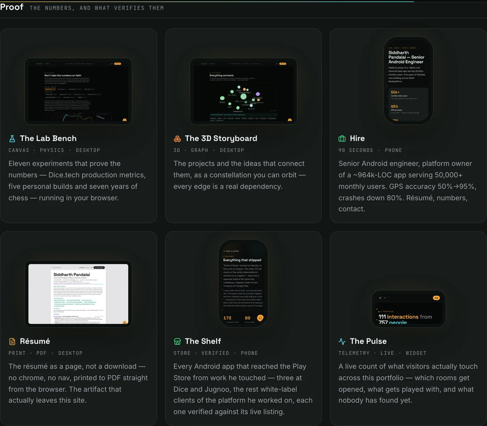

# cv-siddharth

<p align="center">
  
</p>

<p align="center">
  
  
  
  
  <a href="https://vercel.com/sid-pandalais-projects/cv-siddharth"></a>
</p>

**Live: [cv-siddharth.vercel.app](https://cv-siddharth.vercel.app/)**

Interactive CV for **Siddharth Pandalai**, Senior Android Engineer. A portfolio
that demonstrates the work instead of listing it: case studies with real
production metrics, four Kotlin Multiplatform builds running as WebAssembly in
the page, a print-perfect [résumé view](https://cv-siddharth.vercel.app/resume)
(A4, PDF via the print dialog), and an AI assistant ("Panda") that answers
questions about his experience in the third person.

Inspired by [santifer/cv-santiago](https://github.com/santifer/cv-santiago),
rebuilt and simplified: the entire CV fits in an LLM's context, so there is no
RAG pipeline. Knowledge lives in a single generated system prompt
([api/_lib/system-prompt.ts](api/_lib/system-prompt.ts)).

<p align="center">
  <b><a href="#stack">Stack</a></b>&nbsp;&nbsp;·&nbsp;&nbsp;<b><a href="#quick-start">Quick start</a></b>&nbsp;&nbsp;·&nbsp;&nbsp;<b><a href="#the-surfaces">The surfaces</a></b>&nbsp;&nbsp;·&nbsp;&nbsp;<b><a href="#one-registry">One registry</a></b>&nbsp;&nbsp;·&nbsp;&nbsp;<b><a href="#deploy">Deploy</a></b>&nbsp;&nbsp;·&nbsp;&nbsp;<b><a href="#structure">Structure</a></b>&nbsp;&nbsp;·&nbsp;&nbsp;<b><a href="#generators">Generators</a></b>&nbsp;&nbsp;·&nbsp;&nbsp;<b><a href="#gates">Gates</a></b>
</p>

## Stack

React 19 · TypeScript 7 · Vite 8 · TanStack Start · Tailwind v4 · Vercel ·
**provider-agnostic chat backend**. Four providers sit behind one SSE format, so
the widget never knows which answered: **Google Gemini**, **Cerebras**,
**Groq** and **Anthropic Claude**. Whichever keys are configured are tried in
order, with fallback on failure; model names are overridable per provider
(`GROQ_MODEL`, `GEMINI_MODEL`, `CEREBRAS_MODEL`, `ANTHROPIC_MODEL`).

The order is chosen per request by prompt size, not fixed. `providerOrderFor()`
sends anything above `GROQ_TPM_HEADROOM` (7,000 tokens) to the roomier
providers first. The generated system prompt is ~26k chars ≈ 6.6k tokens
on its own, so in practice **every chat request leads with Gemini** and Groq
is the fast path for the short non-chat modes only. This is measured, not
assumed. `chat-handler.test.ts` carries a tripwire that fails if the prompt
grows past the headroom, and it is currently past it. If Groq-first matters,
the fix is a smaller prompt, not a reordered list.

**TypeScript 7.0.2 compatibility note:** The repo runs TypeScript 7.0.2 for compilation (`npx tsc --version` confirms it). Because `typescript-eslint` doesn't support TS 7's compiler API yet (support lands in 7.1), `package.json` uses Microsoft's documented side-by-side pattern: `@typescript/native` (real TS 7.0.2) + `@typescript/typescript6` (TS 6.0-API shim for lint). If lint ever fails with "typescript-eslint does not support TS 7.0" after an `npm install`, check `npx tsc --version` first. If it is not 7.0.2, run `npm install` again to resolve the `tsc` binary race.

## Quick start

```bash
npm install
cp .env.local.example .env.local   # add a chat key to enable Panda
npm run dev
```

Open http://localhost:5173. The site works without a key; the chat widget
shows a contact fallback until one of `GROQ_API_KEY` / `GEMINI_API_KEY` /
`CEREBRAS_API_KEY` / `ANTHROPIC_API_KEY` is set. In dev, a Vite middleware
([vite.config.ts](vite.config.ts)) serves `/api/chat` with the same handler
Vercel runs in production, so no `vercel dev` is needed.

## The surfaces

The site is not a page with a few easter eggs; it is **twenty-two destinations**,
each its own route. The homepage renders every one of them as a tile in the
device frame it is best seen in, and the same grid is reachable from anywhere
via the **Surfaces** launcher in the nav. ⌘K searches by name; the launcher
shows what exists, and you cannot search for a room you do not know about.

<p align="center">
  
  <br/>
  <sub><i>One group of four. Each poster is the route captured at that device's own viewport, not a desktop screenshot cropped to shape.</i></sub>
</p>

| | | |
|---|---|---|
| [`/hire`](https://cv-siddharth.vercel.app/hire) | the 90-second version | numbers, résumé, contact. For someone who will not explore |
| [`/resume`](https://cv-siddharth.vercel.app/resume) | print · pdf | A4 `@page`, no chrome, straight to PDF from the browser |
| [`/shipped`](https://cv-siddharth.vercel.app/shipped) | store · verified | every Android app that reached Play from work he touched, each checked against its live listing |
| [`/lab`](https://cv-siddharth.vercel.app/lab) | canvas · physics | **11 experiments** that prove the numbers: GPS filtering, crash triage, recomposition and module graphs, running in your browser |
| [`/pulse`](https://cv-siddharth.vercel.app/pulse) | telemetry · live | a live count of what visitors actually touch across the site |
| [`/compose`](https://cv-siddharth.vercel.app/compose) | live editor · AI | write Jetpack Compose, watch it recompose in a phone frame |
| [`/ops`](https://cv-siddharth.vercel.app/ops) | control loop · live | every workflow, every generated dataset against its own SLA, what is published and signed, and a ledger of the failures a green check did not catch |
| [`/blueprint`](https://cv-siddharth.vercel.app/blueprint) | 3D · WebGL | the portfolio as an infinite canvas: a three.js fly-through, an ASCII render of the same scene, and a sketchable tldraw whiteboard |
| [`/map`](https://cv-siddharth.vercel.app/map) | 3D · graph | the projects and the ideas connecting them, as an orbitable constellation |
| [`/forge`](https://cv-siddharth.vercel.app/forge) | canvas · interactive | a few thousand particles spring-tied to a letter, parting around the cursor |
| [`/terminal`](https://cv-siddharth.vercel.app/terminal) | text · easter egg | a faux shell you can type in: `ls`, `open doori`, `ask <q>`, `chess clock`. Backtick summons it from any route |
| [`/playground`](https://cv-siddharth.vercel.app/playground) | 3d world · drivable | every room as a building on one street, drivable in 3D; north is 2017, south is now, and a West District turns his employers and case studies into towers |
| [`/chess`](https://cv-siddharth.vercel.app/chess) | 3d · engine | seven years across lichess and chess.com, mined: the rating arc in 3D, a shifting repertoire, a bot that plays like him |
| [`/weeb`](https://cv-siddharth.vercel.app/weeb) | corpus · data | a hand-kept anime list read as evidence, a status column with no word for quitting |
| [`/ink`](https://cv-siddharth.vercel.app/ink) | archive · world | the writing years, before the code |
| [`/excelsior`](https://cv-siddharth.vercel.app/excelsior) | 396 pages | three editions of MANIT's institute magazine, page-turnable in full |
| [`/loopdown`](https://cv-siddharth.vercel.app/loopdown) | field notes | what broke in production, what the fix was, and the numbers on either side |
| [`/anthology`](https://cv-siddharth.vercel.app/anthology) | fiction · starmap | The Morkinstar Journals, forty-eight short stories across four seasons, a navigable starmap and a lore page |
| [`/canon`](https://cv-siddharth.vercel.app/canon) | lore · reference | the rules the Morkinstar Journals are written against: seven laws, the count, the fourteen, and what the rendering can and cannot do |
| [`/making`](https://cv-siddharth.vercel.app/making) | process · receipts | the craft record for the anthology: cross-lab ownership audits, what they killed, two portrait passes, and what the whole thing cost |
| [`/lanes`](https://cv-siddharth.vercel.app/lanes) | corpus · timeline | work, open source, writing and chess, month by month since 2019, on one shared axis |
| [`/time-machine`](https://cv-siddharth.vercel.app/time-machine) | corpus · git history | this repo's own commit history, walked back month by month |

`/terminal`'s own `help` isn't the whole command list by design: nine
commands mark themselves `hidden` and skip it, so they stay things to find
rather than things to read off a screen.

Plus, on the scroll itself:

- **The multiplatform section**. The four Kotlin Multiplatform builds that ship
  a web target, compiled to Wasm and served from this domain, re-framed live
  across the real Android window size classes (compact / medium / expanded).
  One iframe, so changing the form factor re-lays-out the running app instead
  of reloading it. Nothing boots until you click it.
- **Fit check**. Paste a job description and the assistant scores the fit
  honestly, gaps included. Same analyzer as `/jd` in the chat console.
- **Compare viewers**. On project pages, drag to compare two treatments of the
  same screen (light/dark, before/after) where genuine variants exist.
- **Per-project share cards**. Each `/project/<slug>` is server-rendered with
  its own OG/Twitter meta and a branded 1200×630 card (`/p/<slug>/og.png`).
- **Live Signal**. Spotify now-playing and recent GitHub activity, one polling
  hook feeding a footer chip, terminal commands (`spotify`/`np`, `activity`/`gh`)
  and a card on the Blueprint canvas. GitHub works keyless; Spotify needs
  `npm run spotify:auth` once. No keys, no crash, and every surface says
  "not connected".
- **`/read/<slug>`**. The magazine prose as selectable, searchable text rather
  than photographs of paper, each piece linked to the scanned page it ran on.
- **The Canon and The Making**. The anthology's reference shelf: the lore
  rules `/canon` gates behind a spoiler divider, and `/making`'s own record
  of building it, for a reader who wants the machinery, not just the story.
- **A cross-site play layer**. A guest wall anyone can sign, per-piece margin
  notes on `/ink` and every `/read/<slug>`, and reaction rows, all shared
  documents backed by `playhtml`, not a per-visitor toy. `VITE_GUEST_WALL=off`
  removes the wall on the next deploy; nothing here calls a server of his.

## One registry

[`src/data/surfaces.ts`](src/data/surfaces.ts) is the single source for every
route on the site. It feeds the homepage wall, the launcher, the command
palette, the per-route `<head>`, the terminal's `go`/`ls`/`sitemap`, the
sitemap generator, the legacy-hash redirects and the assistant's prompt.

This was four registries and two hardcoded JSX lists. Every one of them
drifted. Nine finished routes were unreachable from the homepage, the palette
reached eleven of sixteen, and the legacy-hash map knew about nine. Adding a
surface now means one entry, and `surfaces.test.ts` derives the route list from
`src/routes/*.tsx` **on disk** and fails the build if a route has no surface, a
surface has no route, a declared poster is missing, an icon is absent or a
`railId` dangles.

## Deploy

Single target: Vercel hosts the TanStack Start server and the chat function
together.

```bash
npx vercel
```

Set at least one chat key in the Vercel project's environment variables.
`api/chat.ts` runs on the Edge runtime and streams SSE straight through to the
widget, with no separate chat host.

That endpoint spends the owner's API key, so it defends itself
([api/\_lib/chat-handler.ts](api/_lib/chat-handler.ts)): an **origin allowlist**
(the live site, this deployment's own Vercel hostnames so previews work,
localhost, plus anything in `ALLOWED_ORIGIN`. A request with no `Origin` header
is refused), a **per-IP rate limit** (`CHAT_RATE_PER_MIN`, default 10;
`CHAT_RATE_PER_HOUR`, default 60 → `429` + `Retry-After`), and **payload caps**
(≤60 messages, ≤64 KB body, ≤2000 chars per user turn, history trimmed before
it reaches a provider). The rate limiter is per-isolate and
therefore best-effort. See the comment above it for what a durable version
would take. `vercel.json` pins the SSR function to `bom1` (Mumbai)
and sets long-lived immutable caching for the WASM lab bundles; TanStack
Start's own router handles all page routing, so there's no rewrite rule to
maintain.

## Structure

<details>
<summary><b>The map</b>: where the registries, the API and the generated data live</summary>
<br/>

```
api/
├── chat.ts                  # Vercel Edge entry
└── _lib/
    ├── chat-handler.ts      # Web-standard handler (shared dev/prod), 4 providers
    ├── system-prompt.ts     # GENERATED — Panda persona + CV knowledge
    └── jd-prompt.ts         # GENERATED — the fit-check analyzer
src/
├── App.tsx                  # The homepage sections, in scroll order
├── routes/                  # One file per route — the router derives from disk
├── data/
│   ├── surfaces.ts          # THE registry: every route, its tile, its device
│   ├── profile.ts           # CV content (single source of truth)
│   ├── labs.ts              # the 11 Lab Bench experiments
│   └── *.ts                 # GENERATED: chess, weeb, store, writing, galleries…
├── lib/navigation.ts        # section ids + hash classification
├── Launcher.tsx             # the wall, from anywhere
├── SurfaceWall.tsx          # the homepage grid
└── index.css                # Tailwind v4 theme tokens
e2e/                         # Playwright: a11y, nav, offline, visitors, smoke
scripts/                     # the generators + the capture/sentinel tooling
```

</details>

## Generators

<details>
<summary><b>Nothing is hand-mirrored</b>: content and assets generate from <code>profile.ts</code>, the registry and the source repos</summary>
<br/>

Twenty-seven `gen:` scripts over thirty-two generator files. The ones you
will actually reach for:

```bash
npm run refresh           # media sync + every generator (stats, galleries, og, prompt…)
npm run gen:system-prompt # rebuild Panda's prompt after editing profile.ts
npm run gen:og            # branded per-project OG cards (/p/<slug>/og.png)
npm run capture:site      # screenshot every route (feeds the sentinel)
```

`gen:og` rasterizes at author time and commits its output, so the Vercel
build needs no browser and no image toolchain.

Five more generator files exist with no `npm run` script, deliberately: each
needs something a build machine doesn't have. `check-generated.mjs`'s header
carries the same reasoning; this is that reasoning where a README reader can
find it.

- `gen-excelsior.mjs`. Manual and occasional: renders the source magazine
  PDFs, which live on MANIT's CDN and are not in this repo, and needs
  `poppler` installed locally. Output is committed; the build never touches
  a PDF.
- `gen-excelsior-text.mjs`. OCRs the rendered pages into a static per-edition
  text manifest (`public/excelsior/text/<year>.json`) so the in-reader search
  has something to search. Needs `tesseract` installed locally; best-effort
  on scanned magazine columns, not a transcript.
- `gen-store-archive.mjs`. Queries the Internet Archive for delisted Play
  listings. A floor, not a count, since the Archive only has what it happened
  to crawl. `npm run gen:store` merges its output.
- `gen-store-flavours.mjs`. Refuses to run without `SHELF_RIDER_REPO` and
  `SHELF_DRIVER_REPO` pointing at two private checkouts, so it cannot run on
  a CI box at all.
- `gen-store-siblings.mjs`. Walks each shelf client's Play developer page
  live, looking for a merchant-side sibling app the rider/driver data misses.
  Writes a gitignored cache; `npm run gen:store` merges it.

</details>

## Gates

The recurring failure in this repo has been a hand-kept list quietly falling
behind the thing it mirrors, with every test green. The gates exist for that
specific shape:

```bash
npm test          # 1269 unit tests across 114 files (vitest)
npm run test:e2e  # 253 Playwright tests across 16 files, every registry route
npm run lint
npm run sentinel  # screenshots: blank, duplicate, uncaptured, orphaned, stale
```

Those two counts are not typed here by hand. `scripts/gen-repo-stats.mjs`
counts the suite with `vitest list`, writes `src/data/repoStats.ts` in the
daily refresh (it reads sibling repos, so it never runs in the hermetic
build stage) and the homepage renders the committed result, so the figure on
the site is generator output, refreshed on a schedule rather than every deploy.
`readme.test.ts` then asserts this file agrees with it. The site once claimed
619 tests in 46 files while the suite had grown to 812 in 73, which is the
whole reason that generator exists.

CI runs five workflows. `ci.yml` is the gate: `tsc -b`, lint and the unit tests
on every push. `lighthouse.yml` builds, runs the full Playwright suite, then
Lighthouse CI over 29 URLs (every top-level route plus all 8 project pages),
one run each, asserting accessibility at 1.00 and SEO at 0.95 as errors,
cumulative layout shift, total byte weight and script size also as errors
(properties of the bytes and the layout, so they measure the same on a CI
runner as on a laptop), and performance, LCP, FCP and total blocking time as
errors too, at thresholds calibrated against a run on this workflow's own
2-core runner rather than the developer laptop the site was first measured
on -- `lighthouserc.json`'s own header carries the run and the numbers.
`/playground` (the WebGL driving room) is the one route excluded from that
last group: its continuous render loop reads as tens of seconds of blocking
time under Lighthouse's CPU-throttled trace, a known characteristic of that
page rather than a regression this gate is positioned to catch. Three more
run on a schedule, not a push:
`refresh-twin.yml` rebuilds the embedded Compose twin daily,
`refresh-media.yml` pulls project media and stats from the app repos daily,
and `screenshot-sentinel.yml` runs the capture sentinel weekly and on any PR
that touches a capture.

Run `npx tsc -b`, not `npx tsc --noEmit`. They are different programs over
different configs, and `--noEmit` misses errors the build fails on.

- `surfaces.test.ts`. The route list on disk against the registry.
- `navigation.spec.ts`. Reads the section ids out of the **rendered** homepage
  and asserts `SECTION_ID_LIST` matches, order included, then proves the command
  palette can reach every route.
- `a11y.spec.ts`. Axe over every route, at desktop **and** 390px, with
  `best-practice` and the experimental `label-content-name-mismatch` rule
  enabled. Lighthouse scores the live site 1.00 on accessibility.
- `beforeTheCode.test.ts`. Every magazine citation points at a scan that exists
  and a `/read` piece that still exists.
- `claim-audit` (in the private harness). Mechanically re-checks every claim
  this site makes about his work before anything outward-facing ships.

## Rendering and vitals

Twenty of the twenty-seven route files server-render. Seven stay client-only:
`/blueprint`, `/compose`, `/forge`, `/map`, `/ops`, `/pulse` and `/terminal`.
Most mount WebGL at their top level; `/ops` is the exception, client-only
because every age on its board is computed at load and a server render would
ship a timestamp already wrong by the time it is read.

`/playground` used to be the seventh. Lighthouse did not score it slow, it
scored it `NO_FCP`, meaning the page painted no content whatsoever: a phone saw
a blank screen until the client bundle and three.js had both arrived. One
import caused it. The room grid reads the interaction counter from a module
that loads `@playhtml/react`, which reads `document` when it is imported, and
that killed the route's SSR in the loader before render began. The counter now
reaches components through a context whose default is a working no-op, which is
the truth on the server anyway, and the route serves its room grid and a baked
terrain plate as real HTML.

Four things hold the numbers up, and each is enforced rather than remembered:

- **Content-hashed assets are immutable.** Everything under `/assets` is
  `max-age=31536000, immutable`. It was `max-age=0, must-revalidate`, so every
  returning visitor paid a revalidation round trip for every file.
- **HTML is cached at the edge** with `s-maxage` and `stale-while-revalidate`,
  which is safe here because two fetches of the same page differ by eight
  characters of router timestamp and nothing else.
- **The LCP element must not animate its opacity.** Chrome does not count a
  transparent element as painted, so an entrance fade adds its own duration to
  the measured LCP. `.rise-in-lcp` in `src/index.css` is the translate-only
  keyframe for anything that could be the largest paint.
- **`content-visibility: auto` on four below-the-fold sections**, every
  `contain-intrinsic-size` measured against the deployed page rather than
  guessed, because a wrong one buys paint time by trading away layout
  stability. Cumulative layout shift measures 0.0086 at `/ops`, the worst URL
  in the fleet, and 0.058 or under everywhere else; `lighthouserc.json` errors
  above 0.25, a ceiling with real headroom rather than the measured figure
  itself.

Generators refuse to make things worse. A fetch that succeeds and returns
nothing is not treated as truth: `gen-chess-stats.mjs`, `gen-timeline.mjs` and
`gen-repo-stats.mjs` each compare against what is already committed and decline
to write a smaller number, because an empty success once deleted three real
chess ratings. `scripts/lib/net.mjs` gives every fetch a timeout and bounded
retries, since a stalled socket never rejects and hung the build for ten
minutes.

## Updating content

Edit [src/data/profile.ts](src/data/profile.ts), then regenerate:

```bash
npm run gen:system-prompt
```

**Do not hand-edit `api/_lib/system-prompt.ts` or `api/_lib/jd-prompt.ts`**,
both are generated from `profile.ts` and say so in their first line. Editing
them directly gets silently overwritten on the next build, and the page and
Panda drift apart. The generator is what keeps them in sync.

Adding a route? One entry in [src/data/surfaces.ts](src/data/surfaces.ts) and
one file in `src/routes/`. The wall, the launcher, the palette, the terminal,
the sitemap, the `<head>` and the assistant all pick it up; the gates fail the
build if you do only half of it.
